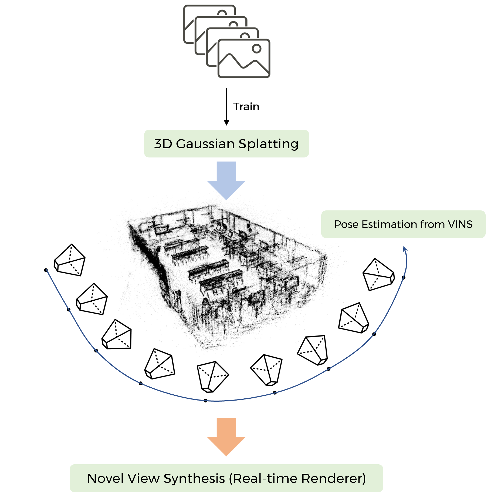

# 3D Gaussian Splatting Real-time Renderer from VINS Pose

## Detailed Flow
<table>
  <tr>
     <td>  </td>     
  </tr> 
</table>

## Build 
Clone the repository and catkin_make:
```
    $ cd ~/catkin_ws/src
    $ git clone https://github.com/SungJaeShin/Gaussian_Splatting_Realtime_Render.git
    $ cd ../
    $ catkin build camera_models
    $ source ~/catkin_ws/devel/setup.bash
    $ catkin build vins
    $ source ~/catkin_ws/devel/setup.bash
```

## Run
**You must have a pre-trained model and have bag data and camera parameters !!!**
```
    # Terminal 1
    $ rosrun vins vins_node ./VINS-Fusion/config/euroc/euroc_stereo_imu_config.yaml

    # Terminal 2
    $ python3 realtime_render.py
 
```


## Results (KAIST N25 Building Indoor Dataset) 
- Random Pose from VINS-Fusion Keyframe Pose \
    

- Fixed z position from VINS-Fusion Keyframe Pose \
    


## Reference 
[1] [VINS-Fusion](https://github.com/HKUST-Aerial-Robotics/VINS-Fusion.git) \
[2] [Gaussian Splatting](https://github.com/graphdeco-inria/gaussian-splatting.git) 

